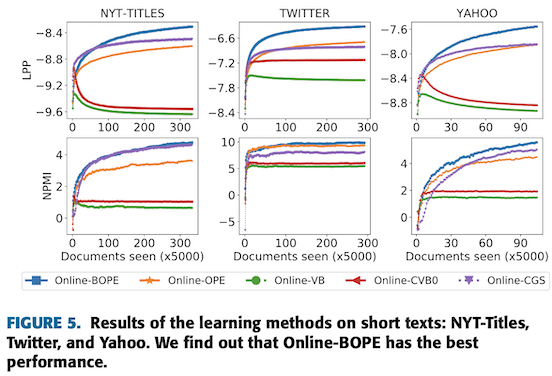

# Topic Modelling on short-text data 

Extracting topics from a corpus of short-text data (e.g., survey answers, news titles, online chat records, blog comments) is considered as a difficult task for classical topic modelling approaches such as **LDA (Latent Dirichlet Allocation)**. This is because short-text is sparse data, and LDA's original MAP estimation algorithm works poorly on sparse data.

In recent 2020 paper, authors proposed a novel MAP estimation algorithm, ***called BOPE***, which uses Bernoulli randomness for Online Maximum a Posteriori Estimation:
- BOPE solves non-convex MAP problem via Bernoulli sampling and stochastic bounds. It is stochastic in nature and converges to a stationary point of the MAP problem at a rate of O(1/T) which is the state-of-the-art convergence rate, where T denotes the number of iterations.
- In particular, the paper proves that Bernoulli randomness in BOPE plays the regularization role which reduces severe overfitting for probabilistic models in ill-posed cases such as short-text.

For empirical evaluation purposes, authors adopt BOPE for solving MAP inference in LDA, and show its effectiveness on short-text data in comparison to other MAP inference methods. 

-------

 

Probabilistic models such as LDA exploit statistical inference methods to discover latent patterns of data.

to do with traditional Topic Modelling methods such as LDA (Latent Dirichlet Allocation).

LDA performs well on long text data but its performance on short text data is not the best. Its underperformance on short text data is associated with its posterior inference algorithm - OPE (Online Maximum a Posteriori Estimation).
In order to address disadvantage of OPE algorithm, one solution came from [recent paper](https://ieeexplore.ieee.org/stamp/stamp.jsp?tp=&arnumber=9138369) around novel algorithm, called BOPE, which uses Bernoulli randomness for OPE.

For empirical evaluations, paper uses BOPE and many other previous algorithms (OPE, VB, CVB0, CGS) on datasets with different average length per document:

| Datasets       | Corpus size  | Average length per doc  | Vocabulary size|
| :------------- | :----------: | -----------: |-----------: |
| New York Times | 300,000   | 325.13    | 102,661 |
| PubMed | 330,000 | 65.12 | 141,044 |
| Yahoo Questions | 517,770 | 4.73 | 24,420 | 
| Twitter tweets | 1,457,687 | 10.14 | 89,474 | 
| NYT-Titles | 1,664,127 | 5.15 | 55,488 | 

&nbsp;
&nbsp;

#### Performance Measures:
- Log Predictive Probability (LPP):

    Predictive Probability shows the predictiveness and generalization of a model M on new data. We follow the procedure in [this paper](https://arxiv.org/pdf/1206.6425.pdf) to compute this measurement. 

- Normalised Pointwise Mutual Information (NPMI): 

    NPMI measurements helps us to see the coherence or seman- tic quality of individual topics. According to [this paper](https://www.ams.org/journals/tran/1943-054-03/S0002-9947-1943-0009263-7/S0002-9947-1943-0009263-7.pdf), NPMI agrees well with human evaluation on interpretability of topic models.

#### **Comparison of results:**

&nbsp;
&nbsp;

As seen above, BOPE shows higher results across the different datasets. 

