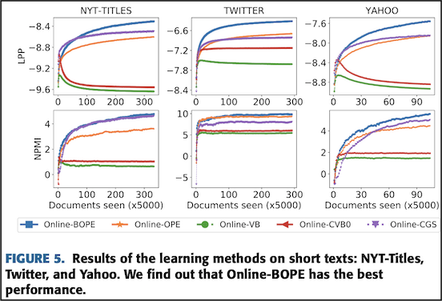

# LDA on short text - Pulse Survey 
 
LDA performs well on long text data but its performance on short text data is not the best. Its underperformance on short text data is associated with its posterior inference algorithm - OPE (Online Maximum a Posteriori Estimation).
In order to address disadvantage of OPE algorithm, one solution came from [recent paper](https://ieeexplore.ieee.org/stamp/stamp.jsp?tp=&arnumber=9138369) around novel algorithm, called BOPE, which uses Bernoulli randomness for OPE.

For empirical evaluations, paper uses BOPE and many other previous algorithms (OPE, VB, CVB0, CGS) on datasets with different average length per document:

| Datasets       | Corpus size  | Average length per doc  | Vocabulary size|
| :------------- | :----------: | -----------: |-----------: |
| New York Times | 300,000   | 325.13    | 102,661 |
| PubMed | 330,000 | 65.12 | 141,044 |
| Yahoo Questions | 517,770 | 4.73 | 24,420 | 
| Twitter tweets | 1,457,687 | 10.14 | 89,474 | 
| NYT-Titles | 1,664,127 | 5.15 | 55,488 | 

&nbsp;
&nbsp;

#### Performance Measures:
- Log Predictive Probability (LPP):

    Predictive Probability shows the predictiveness and generalization of a model M on new data. We follow the procedure in [this paper](https://arxiv.org/pdf/1206.6425.pdf) to compute this measurement. 

- Normalised Pointwise Mutual Information (NPMI): 

    NPMI measurements helps us to see the coherence or seman- tic quality of individual topics. According to [this paper](https://www.ams.org/journals/tran/1943-054-03/S0002-9947-1943-0009263-7/S0002-9947-1943-0009263-7.pdf), NPMI agrees well with human evaluation on interpretability of topic models.

#### **Comparison of results:**

&nbsp;
&nbsp;

As seen above, BOPE shows higher results across the different datasets.

